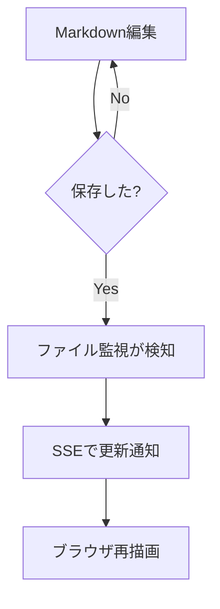
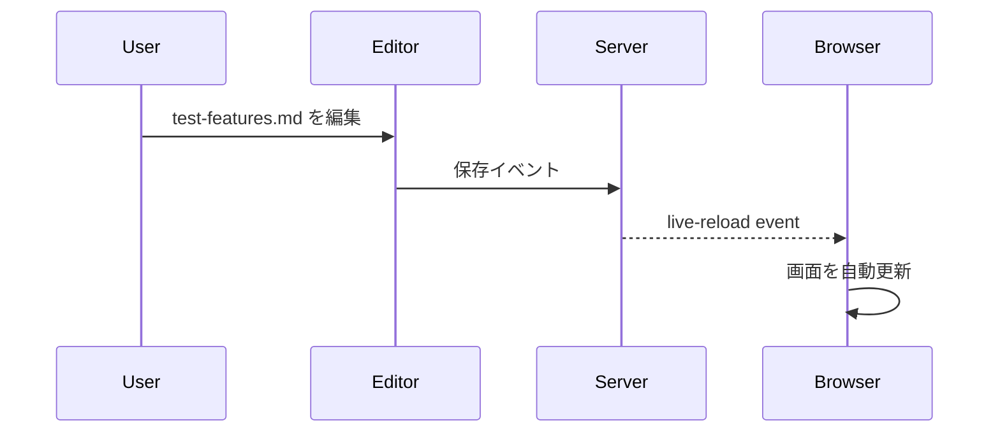

# P2機能テスト用ドキュメント

このファイルは **Mermaid / KaTeX / テーマ切替 / ライブリロード** の確認用です。  
このファイルを編集・保存すると自動でリロードされます。

## H2: クイックチェック

- **太字** の表示確認
- *斜体* の表示確認
- ~~取り消し線~~ の表示確認
- [プロジェクトREADME](./README.md) へのリンク確認
- [Example外部リンク](https://example.com) の色・ホバー確認

### H3: ライブリロード確認手順

1. この `test-features.md` を開いたままにする
2. 任意の1行を編集して保存する
3. ブラウザが自動更新されることを確認する

## Mermaid（フローチャート）



## Mermaid（シーケンス図）



## KaTeX 数式

インライン数式: オイラーの等式 $e^{i\pi} + 1 = 0$ と、ガウス分布 $f(x)=\frac{1}{\sigma\sqrt{2\pi}}e^{-\frac{(x-\mu)^2}{2\sigma^2}}$。

ブロック数式:

$$
\int_{-\infty}^{\infty} e^{-x^2}\,dx = \sqrt{\pi}
$$

$$
\nabla \cdot \vec{E} = \frac{\rho}{\varepsilon_0}, \qquad
\nabla \times \vec{B} = \mu_0\vec{J} + \mu_0\varepsilon_0\frac{\partial \vec{E}}{\partial t}
$$

## コードブロック（シンタックスハイライト）

```ts
import { readFileSync } from 'node:fs';

function loadMarkdown(path: string): string {
  return readFileSync(path, 'utf8');
}

console.log(loadMarkdown('test-features.md').slice(0, 40));
```

## テーブル

| 項目 | ライトテーマ | ダークテーマ |
|---|---|---|
| 背景色 | 明るい背景 | 暗い背景 |
| 文字色 | 濃い文字 | 明るい文字 |
| リンク色 | 標準リンク色 | コントラスト高め |
| コード背景 | 薄いグレー系 | 濃いグレー系 |

## 引用（blockquote）

> テーマ切替時に、見出し・本文・リンク・コード・表のコントラストが保たれることを確認してください。

## 画像（placeholder）


